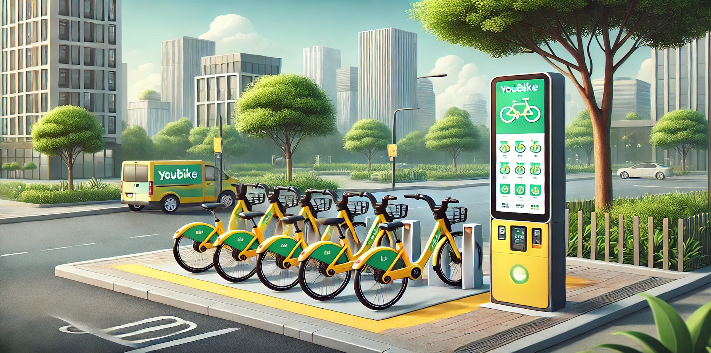

<html lang="en">
<head>
    <meta charset="UTF-8">
    <meta name="viewport" content="width=device-width, initial-scale=1.0">
    <title>Da-Wei Hao - iOS Developer</title>
    
    
</head>
<body>
    <header>
        <h1>Da-Wei Hao Portfolio</h1>
    </header>

    

        
        
    

    <h2>iOS Projects</h2>

    

        <!-- Drink Order App -->
        

            
            

                <h3>Drink Order App</h3>
                
A custom drink ordering application showcasing UI design and order management.

                

                    <a href="https://github.com/dwhao84/DrinkOrderApp" class="github"><i class="fab fa-github"></i>GitHub</a>
                    <a href="https://medium.com/彼得潘的-swift-ios-app-開發教室/hw-50-drink-order-app-1-get-6d4f7566c6f5" class="medium"><i class="fab fa-medium"></i>Medium</a>
                

            

        

        <!-- App Store App -->
        

            
            

                <h3>App Store App</h3>
                
Recreation of the App Store interface demonstrating UIKit proficiency.

                

                    <a href="https://github.com/dwhao84/HW48-App-store" class="github"><i class="fab fa-github"></i>GitHub</a>
                    <a href="https://medium.com/彼得潘的-swift-ios-app-開發教室/hw-48-app-store-425538e1f98b" class="medium"><i class="fab fa-medium"></i>Medium</a>
                

            

        

        <!-- YouBike App -->
        

            
            

                <h3>YouBike App</h3>
                
Implementation of JSON decoding and Core Data with the YouBike API.

                

                    <a href="https://github.com/dwhao84/HW-44-JSON-Decoder" class="github"><i class="fab fa-github"></i>GitHub</a>
                    <a href="https://medium.com/彼得潘的-swift-ios-app-開發教室/hw-47-串接you-bike-api-資料存到core-data-70fa9782e915" class="medium"><i class="fab fa-medium"></i>Medium</a>
                

            

        

        <!-- Psychological Quiz App -->
        

            
            

                <h3>Psychological Quiz App</h3>
                
Interactive quiz application built with UIKit and Storyboard.

                

                    <a href="https://github.com/dwhao84/HW37_PsychologicalTest" class="github"><i class="fab fa-github"></i>GitHub</a>
                    <a href="https://medium.com/彼得潘的-swift-ios-app-開發教室/hw-37-psychologicaltest-心理測驗-with-storyboard-747b1de293f7" class="medium"><i class="fab fa-medium"></i>Medium</a>
                

            

        

        <!-- Multiple Choice App -->
        

            
            

                <h3>Multiple Choice App</h3>
                
Educational app featuring multiple choice questions and scoring.

                

                    <a href="https://github.com/dwhao84/HW36_MultipleChoiceChallenge" class="github"><i class="fab fa-github"></i>GitHub</a>
                    <a href="https://medium.com/彼得潘的-swift-ios-app-開發教室/hw36-multiple-choice-選擇題-d55c2e9e6089" class="medium"><i class="fab fa-medium"></i>Medium</a>
                

            

        

    

    

        <a href="path/to/your/resume.pdf" class="download-button" download>
            <i class="fas fa-file-download"></i>Download Resume
        </a>
    

       <footer>
        

            <a href="https://github.com/dwhao84" target="_blank" rel="noopener noreferrer">
                <i class="fab fa-github"></i>
            </a>
            <a href="https://twitter.com/YourTwitterHandle" target="_blank" rel="noopener noreferrer">
                <i class="fab fa-twitter"></i>
            </a>
        

    </footer>
</body>
</html>