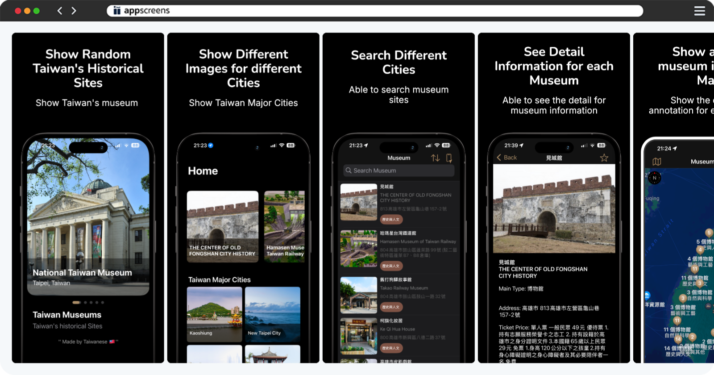

# Da-Wei Hao
## iOS Developer

📱 0987-665-751 | 📧 dwsamurai84@gmail.com  
💻 GitHub: [dwhao84](https://github.com/dwhao84) | 📝 Medium: [@dwsamurai84_dev](https://medium.com/@dwsamurai84_dev)

---

## Skills

### iOS Development
- 2 years experience with Swift
- UIKit framework and Programmatic UI
- Design Patterns: MVC, MVVM, Singleton, Notification
- RESTful API integration
- Core Data & UserDefaults
- Git version control & Swift Package Manager & Cocoapods
- Push Notifications: FCM, APNs
- Localization implementation
- Dark Mode support

---

## Project Experience

### Taiwan Museum

Developed an iOS application showcasing museums across Taiwan by integrating government API [data](https://data.gov.tw/en/datasets/6242).

**Key Technologies:**

- MVVM Design Pattern
- Programmatic UI
- Localization (Supports 7 languages)
- Core Data
- Dark Mode support
- Google Anaylytics 
- Firebase Crashlytics

### Taiwan Coordinate Converter

[📲 App Store](https://apps.apple.com/tw/app/taiwan-coordinate-converter/id6741114893?l=en-GB)

Developed an iOS application integrating MapKit for real-time location tracking, featuring custom algorithms for Taiwan coordinate system conversions, and utilizing Core Data for emergency contact storage. The app supports one-tap emergency calling functionality for quick response during critical situations.

**Key Technologies:**

- Programmatic UI
- Localization (Supports 7 languages)
- Core Data
- Dark Mode support
- Google Anaylytics 

### Inventory App

I developed this app using Programmatic UI, integrated it with a custom Airtable backend API to implement CRUD operations, and learned how to set up server-side storage for beverage data. The app uses URLSession to fetch and parse JSON data from the server, displaying the information in the app's UI where users can browse and order materials.

**Key Technologies:**

- Programmatic UI
- URLSession integration with Airtable API
- RESTful API
- Firebase Auth
- Google Anaylytics 

### Drink Order App

[📝 Project Overview](https://medium.com/彼得潘的-swift-ios-app-開發教室/hw-50-drink-order-app-1-get-6d4f7566c6f5) | [💻 GitHub](https://github.com/dwhao84/DrinkOrderApp)

Developed this app using Programmatic UI, integrated it with a custom Airtable backend API to implement CRUD operations, and learned how to set up server-side storage for beverage data. The app uses URLSession to fetch and parse JSON data from the server, displaying the information in the app's UI where users can browse and order drinks.

**Key Technologies:**

- Programmatic UI
- URLSession integration with Airtable API
- RESTful API
- Firebase Auth

### App Store App

[📝 Project Overview](https://medium.com/彼得潘的-swift-ios-app-開發教室/hw-48-app-store-425538e1f98b) | [💻 GitHub](https://github.com/dwhao84/HW48-App-store)

This iOS project integrates with the App Store API using URLSession and displays the top 25 popular applications using TableView. It supports toggling between free/paid apps and features dark/light mode compatibility.

**Key Technologies:**

- Programmatic UI
- URLSession integration with App Store API
- RESTful API
- Firebase Auth
- Dark Mode support
- TableView

### YouBike Station Finder & Navigation App

[📝 Project Overview](https://medium.com/彼得潘的-swift-ios-app-開發教室/hw-47-串接you-bike-api-資料存到core-data-70fa9782e915) | [💻 GitHub](https://github.com/dwhao84/HW-44-JSON-Decoder)

This YouBike station finder app includes the following key features:
- Real-time station information display (via API integration)
- Map navigation (location services + route planning)
- Favorite station management (using Core Data)

**Demo Videos:**
- [Demo 1](https://youtube.com/shorts/KihgTuhh8WI?si=YMUgAe0ixhrJkxpt)
- [Demo 2](https://youtube.com/shorts/mkjUWid6G_0?si=1spcBqN0IRjdzoIr)

**Key Technologies:**

- Programmatic UI
- URLSession API integration
- Core Data
- MapKit
- Dark Mode support
- TableView

---

## Work Experience
- **IKEA Shopkeeper** (March 2022 - Present)
- **IKEA Merchandise Display Specialist** (June 2018 - March 2022)

---

## Community Experience
- iPlayground Staff Member (2024)

---

## Contact Information & Online Resources
- ✉️ Email: dwsamurai84@gmail.com
- 💻 GitHub: [dwhao84](https://github.com/dwhao84)
- 📝 Medium: [@dwsamurai84_dev](https://medium.com/@dwsamurai84_dev)
- 📝 HackMD: [@dwhao84](https://hackmd.io/@dwhao84)