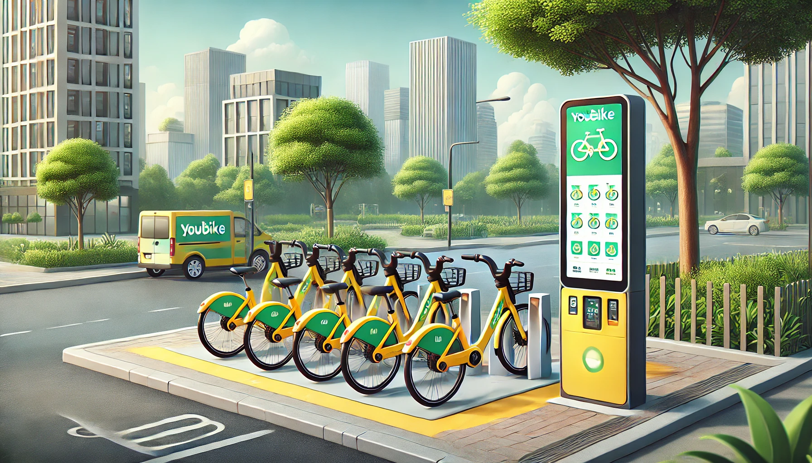

# **Projects**

## **Taiwan Museum**

- Developed an iOS application showcasing museums across Taiwan by integrating government API [data](https://data.gov.tw/en/datasets/6242).

### **Technologies Used:**
- MVVM Design Pattern
- Programmatically UI
- Localizations (Support 24 Languages)
- Core Data
- Dark Mode
- Google Anaylytics 
- Firebase Crashlytics

---

## **Taiwan Coordinate Converter**

- [App Store](https://apps.apple.com/tw/app/taiwan-coordinate-converter/id6741114893?l=en-GB)
- I built an iOS app that implements MapKit for real-time location tracking, features custom algorithms for Taiwan coordinate system conversions, and utilizes Core Data for emergency contact storage. The app enables one-tap emergency calling functionality for quick response during critical situations.

### **Technologies Used:**
- Programmatically UI
- Localizations (Support 7 Languages)
- Core Data
- Dark Mode
- Google Anaylytics 

---

## **Inventroy App**

I developed this app using Programmatic UI, integrated it with a custom Airtable backend API to implement CRUD operations, and learned how to set up server-side storage for beverage data. The app uses URLSession to fetch and parse JSON data from the server, displaying the information in the app's UI where users can browse and order materials.

**Key Technologies:**

- Programmatic UI
- Pagination
- URLSession integration with Airtable API
- RESTful API
- Firebase Auth
- Google Anaylytics 

---

## **Drink Order App**
 

- [Project Overview](https://medium.com/彼得潘的-swift-ios-app-開發教室/hw-50-drink-order-app-1-get-6d4f7566c6f5) | [GitHub](https://github.com/dwhao84/DrinkOrderApp)

I developed this app using Programmatic UI, integrated it with a custom Airtable backend API to implement CRUD operations, and learned how to set up server-side storage for beverage data. The app uses URLSession to fetch and parse JSON data from the server, displaying the information in the app's UI where users can browse and order drinks.

---

## **App Store App**

- [Project Overview](https://medium.com/彼得潘的-swift-ios-app-開發教室/hw-48-app-store-425538e1f98b) | [GitHub](https://github.com/dwhao84/HW48-App-store)

This iOS project integrates with the App Store API using URLSession and displays the top 25 popular applications using TableView. It supports toggling between free/paid apps and features dark/light mode compatibility.

---

## **YouBike Station Finder & Navigation App**

- [Project Overview](https://medium.com/彼得潘的-swift-ios-app-開發教室/hw-47-串接you-bike-api-資料存到core-data-70fa9782e915) | [GitHub](https://github.com/dwhao84/HW-44-JSON-Decoder)

This YouBike station finder app includes the following key features:

- Real-time station information display (via API integration)
- Map navigation (location services + route planning)
- Favorite station management (using Core Data)

**Demo Videos:**
- [Demo 1](https://youtube.com/shorts/KihgTuhh8WI?si=YMUgAe0ixhrJkxpt)
- [Demo 2](https://youtube.com/shorts/mkjUWid6G_0?si=1spcBqN0IRjdzoIr)