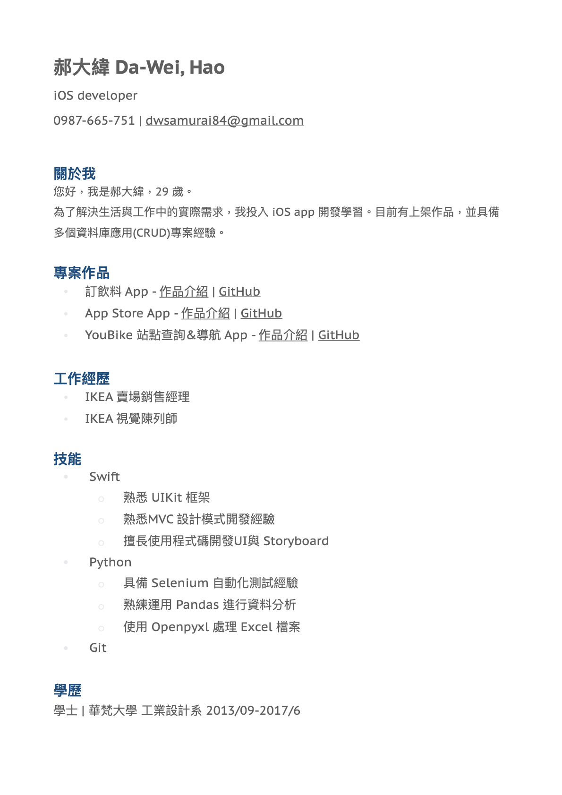

# 關於我

## GitHub Stats

 

## 聯絡方式 & 技術文章

- ✉️ Email: [dwsamurai84@gmail.com](mailto:dwsamurai84@gmail.com)
- 💻 GitHub: [dwhao84](https://github.com/dwhao84)
- 📝 Medium: [@dwsamurai84_dev](https://medium.com/@dwsamurai84_dev)
- 📝 HackMD: [@dwhao84](https://hackmd.io/@dwhao84)

本網站使用 [MkDocs Material](https://squidfunk.github.io/mkdocs-material/) 主題建置。
