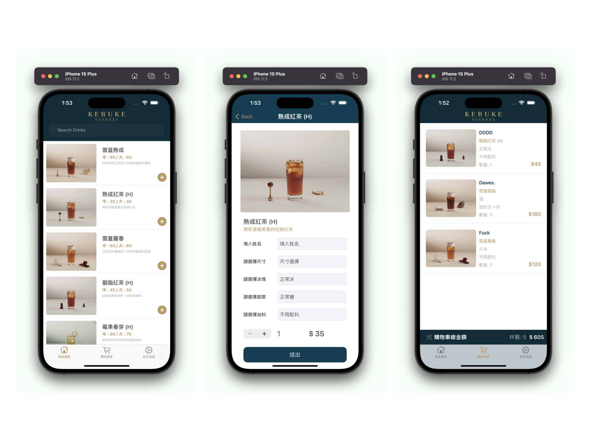
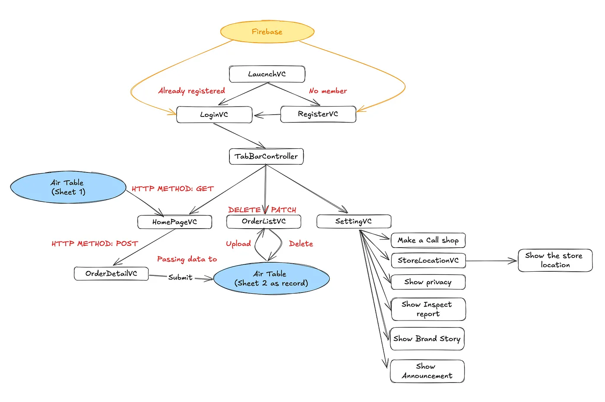

我來幫您將履歷翻譯成繁體中文：

# **郝大緯**

iOS 開發工程師
0987-665-751 | [dwsamurai84@gmail.com](https://github.com/dwhao84/dwhao84.github.io.git)

## **技能**

- **Swift**
  - Swift 語言使用經驗一年
  - UIKit
  - Git / Swift Package Manager / RESTful API
  - 設計模式：MVC / singletion /Notification

## **專案經驗**

### **飲料訂購 App**

 

- [Medium](https://medium.com/彼得潘的-swift-ios-app-開發教室/hw-50-drink-order-app-1-get-6d4f7566c6f5) | [GitHub](https://github.com/dwhao84/DrinkOrderApp)
  - 使用 UIKit Programmatically UI製作畫面，透過 URLSession 串接 Airtable API 並實現 RESTful API的功能，能夠訂購飲料以及展示與訂購功能。

### **App Store 應用程式**

- [Medium](https://medium.com/彼得潘的-swift-ios-app-開發教室/hw-48-app-store-425538e1f98b) | [GitHub](https://github.com/dwhao84/HW48-App-store)
  - 使用 UIKit Programmatically UI製作畫面，透過 URLSession 串接 App Store API，使用 UITableView 顯示前 25 名熱門應用程式，具備免費/付費應用程式切換功能，並支援淺色/深色模式。

### **YouBike 站點搜尋與導航 App**

- [Medium](https://medium.com/彼得潘的-swift-ios-app-開發教室/hw-47-串接you-bike-api-資料存到core-data-70fa9782e915) | [GitHub](https://github.com/dwhao84/HW-44-JSON-Decoder)
  - 開發 YouBike 應用程式，整合開放資料 API 提供即時站點搜尋、導航功能與收藏管理。使用 UIKit 開發，運用 MKMapKit 實現地圖功能，並採用 Core Data 進行資料儲存。

## **工作經驗**

- **宜家家居 店務專員** 2022/3－至今
- **宜家家居 商品陳列專員** 2018/6－2022/3

## **GitHub 統計資料**

 

## **聯絡方式與部落格**

- ✉️ 電子郵件：[dwsamurai84@gmail.com](mailto:dwsamurai84@gmail.com)
- 💻 GitHub：[dwhao84](https://github.com/dwhao84)
- 📝 Medium：[@dwsamurai84_dev](https://medium.com/@dwsamurai84_dev)
- 📝 HackMD：[@dwhao84](https://hackmd.io/@dwhao84)

本網站使用 [MkDocs Material](https://squidfunk.github.io/mkdocs-material/) 主題建置。
