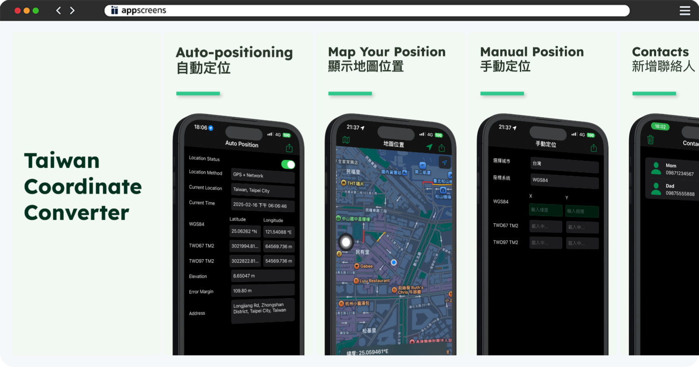

# **郝大緯**

**iOS 工程師**

📱 0987-665-751 | 📧 [dwsamurai84@gmail.com](mailto:dwsamurai84@gmail.com)

---

## **技能**

### **iOS 開發**
- Swift 語言使用經驗 2 年
- UIKit 框架
- Git 版本控制
- Swift Package Manager
- RESTful API 整合
- Core Data & UserDefaults
- 設計模式：MVC、MVVM、Singleton、Notification
- 推播通知：FCM、APNs
- 多國語系實作

---

## **專案經驗**

### **台灣博物館**

透過整合政府 API [資料](https://data.gov.tw/en/datasets/6242)開發了一款展示台灣各地博物館的 iOS 應用程式。

**使用的技術：**
- MVVM 設計模式
- 程式化 UI
- 多國語系（支援 24 種語言）
- Core Data
- 深色模式支援

---

### **台灣座標轉換器**

[📲 App Store 下載連結](https://apps.apple.com/tw/app/taiwan-coordinate-converter/id6741114893?l=en-GB)

我開發了一款 iOS 應用程式，該應用整合了 MapKit 實現即時位置追蹤，具有專為台灣座標系統轉換設計的自訂演算法，並使用 Core Data 儲存緊急聯絡人資訊。此應用支援一鍵緊急通話功能，在緊急情況下能快速回應。

**使用的技術：**
- 程式化 UI
- 多國語系（支援 7 種語言）
- Core Data
- 深色模式支援

---

### **飲料訂購 App**
 

[📝 專案詳情](https://medium.com/彼得潘的-swift-ios-app-開發教室/hw-50-drink-order-app-1-get-6d4f7566c6f5) | [💻 GitHub 程式碼](https://github.com/dwhao84/DrinkOrderApp)

使用 UIKit 程式化 UI 製作畫面，透過 URLSession 串接 Airtable API 並實現 RESTful API 功能，能夠顯示飲料資訊以及提供訂購功能。

---

### **App Store 應用程式**

[📝 專案詳情](https://medium.com/彼得潘的-swift-ios-app-開發教室/hw-48-app-store-425538e1f98b) | [💻 GitHub 程式碼](https://github.com/dwhao84/HW48-App-store)

使用 UIKit 程式化 UI 製作畫面，透過 URLSession 串接 App Store API，使用 UITableView 顯示前 25 名熱門應用程式，具備免費/付費應用程式切換功能，並支援淺色/深色模式。

---

### **YouBike 站點搜尋與導航 App**

[📝 專案詳情](https://medium.com/彼得潘的-swift-ios-app-開發教室/hw-47-串接you-bike-api-資料存到core-data-70fa9782e915) | [💻 GitHub 程式碼](https://github.com/dwhao84/HW-44-JSON-Decoder)

開發 YouBike 應用程式，整合開放資料 API 提供即時站點搜尋、導航功能與收藏管理。使用 UIKit 開發，運用 MKMapKit 實現地圖功能，並採用 Core Data 進行資料儲存。

---

## **工作經驗**

- **宜家家居 店務專員** (2022/3 - 至今)
- **宜家家居 商品陳列專員** (2018/6 - 2022/3)

---

## **社團經驗**

- iPlayground 工作人員 (2024)

---

## **GitHub 統計資料**

  

---

## **聯絡方式與線上資源**

- ✉️ 電子郵件：[dwsamurai84@gmail.com](mailto:dwsamurai84@gmail.com)
- 💻 GitHub：[dwhao84](https://github.com/dwhao84)
- 📝 Medium：[@dwsamurai84_dev](https://medium.com/@dwsamurai84_dev)
- 📝 HackMD：[@dwhao84](https://hackmd.io/@dwhao84)

---

*本網站使用 [MkDocs Material](https://squidfunk.github.io/mkdocs-material/) 主題建立。*