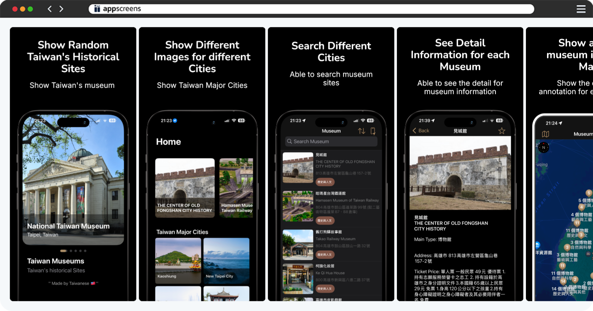
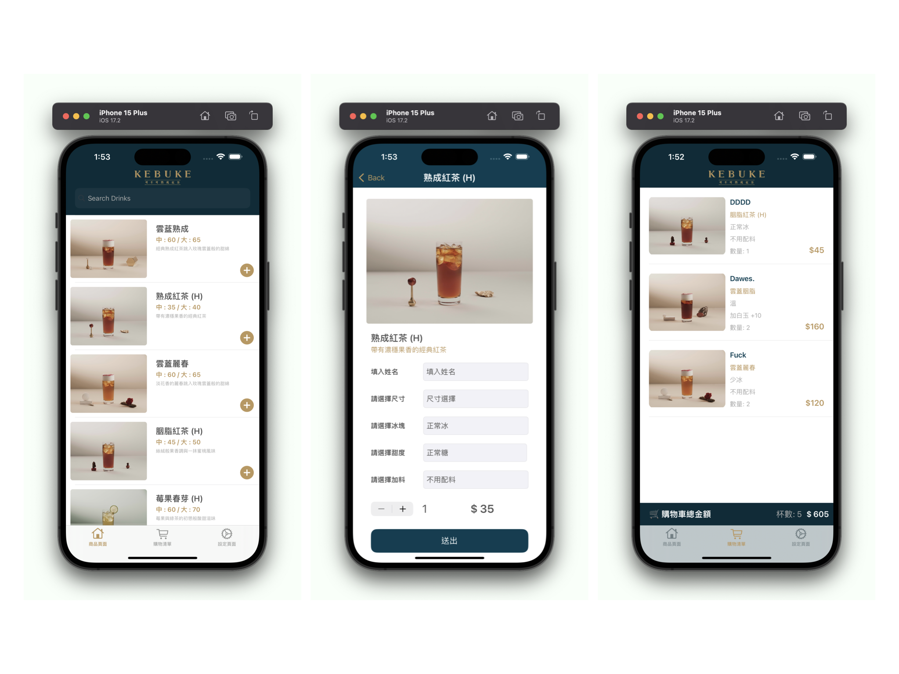

# **專案**

## 台灣博物館

- 透過整合政府 API [資料](https://data.gov.tw/en/datasets/6242)開發了一款展示台灣各地博物館的 iOS 應用程式。

### **台灣博物館**
- 使用的技術：
  - MVVM
  - 程式UI
  - 多國語系（支援 7 種語言）
  - Core Data
  - 深色模式

## 台灣座標轉換器

- [App Store](https://apps.apple.com/tw/app/taiwan-coordinate-converter/id6741114893?l=en-GB)
- 我開發了一款 iOS 應用程式，該應用整合了 MapKit 實現即時位置追蹤，具有專為台灣座標系統轉換設計的自訂演算法，並使用 Core Data 儲存緊急聯絡人資訊。此應用支援一鍵緊急通話功能，在緊急情況下能快速回應。

- 使用的技術：
  - 程式UI
  - 多國語系（支援 7 種語言）
  - Core Data
  - 深色模式

- 訂飲料 App - [作品介紹](https://medium.com/彼得潘的-swift-ios-app-開發教室/hw-50-drink-order-app-1-get-6d4f7566c6f5) | [GitHub](https://github.com/dwhao84/DrinkOrderApp)

我運用 Programmatically UI 的方式來製作介面，並且串接自己建立的 Airtable 後台 API 來實現資料的 CRUD 操作，同時也知道如何設置伺服器端存儲飲料資料，使用 URLSession 從伺服器獲取並解析 JSON 資料，最後將這些資料顯示在應用程式的 UI 中，讓使用者可以瀏覽和訂購飲料。

- App Store App - [作品介紹](https://medium.com/彼得潘的-swift-ios-app-開發教室/hw-48-app-store-425538e1f98b) | [GitHub](https://github.com/dwhao84/HW48-App-store)

這是一個透過 URLSession 串接 App Store API，使用 TableView 展示前 25 名熱門應用程式，並支援免費/付費切換與深淺色模式的 iOS 專案。

- YouBike 站點查詢&導航 App - [作品介紹](https://medium.com/彼得潘的-swift-ios-app-開發教室/hw-47-串接you-bike-api-資料存到core-data-70fa9782e915) | [GitHub](https://github.com/dwhao84/HW-44-JSON-Decoder)

這是一個 YouBike 站點查詢 App，具備以下主要功能：

- 即時站點資訊顯示 (透過 API 串接)
- 地圖導航 (定位 + 路線規劃)
- 收藏站點管理 (使用 Core Data)

- [Demo 1](https://youtube.com/shorts/KihgTuhh8WI?si=YMUgAe0ixhrJkxpt)

- [Demo 2](https://youtube.com/shorts/mkjUWid6G_0?si=1spcBqN0IRjdzoIr)
